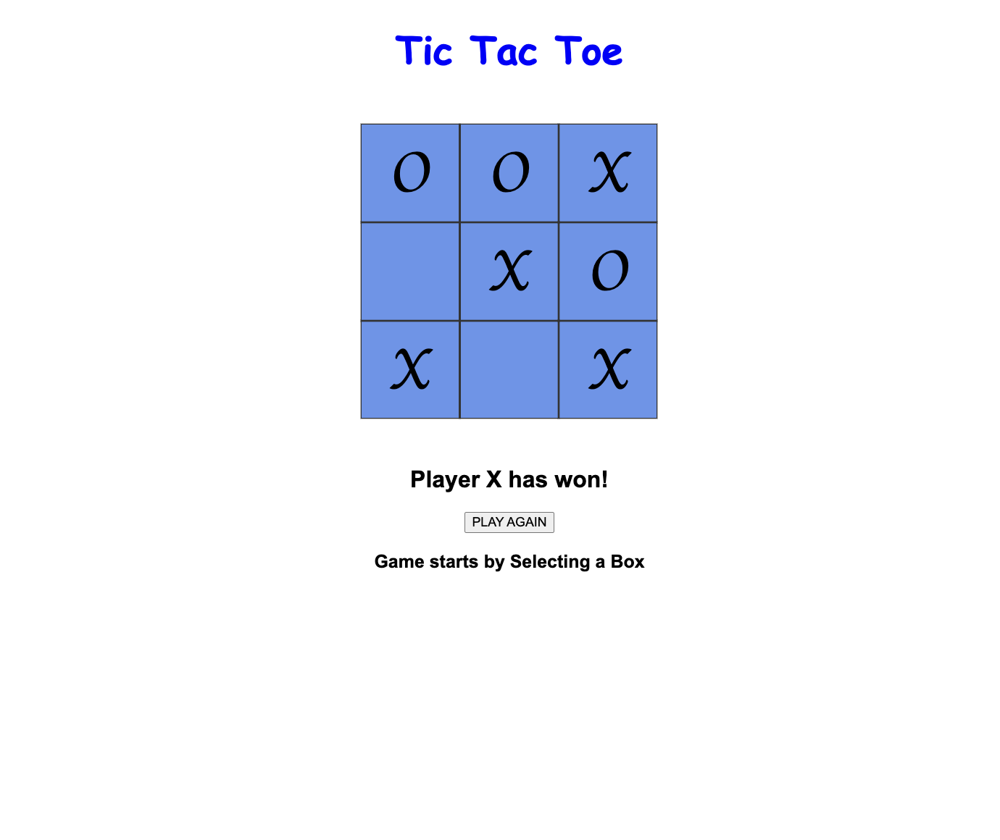
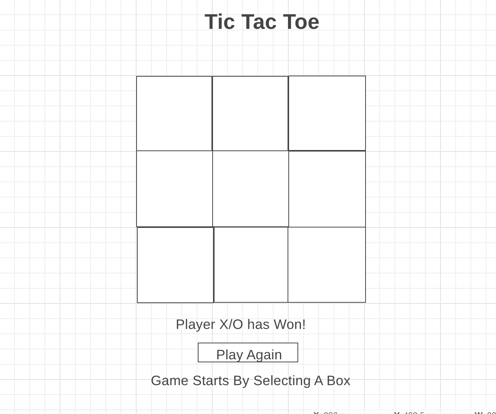

# Tic-Tac-Toe
A tic tac toe game created in HTML, CSS, and JavaScript
# Objectives
* Build a tic tac toe game in HTML, CSS, and vanilla JavaScript
* Use best practices when writing code, DRY (Do Not Repeat Yourself) code is always a better option
* Create a portfolio worthy project with your own personal style

# Description
* A user should be able to click on different squares to make a move.
* Every click will alternate between marking an X and O
* A cell should not be able to be replayed once marked.
* You should not be able to click remaining empty cells after the game is over.
* Add a reset button that will clear the contents of the board.
* Display a message to indicate which turn is about to be played.
* Detect draw conditions (ties/cat's game)

## Links
- Wire Frame
(https://wireframe.cc/bJiQ4W)

- Deployed Application
(https://perfect-actor12345.surge.sh/)

## Application Screenshot

## Wire Frame
